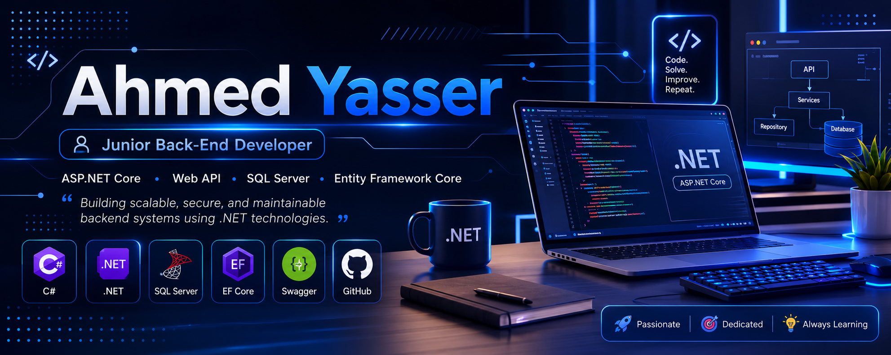

# Ahmed Yasser

### Junior Back-End Developer | .NET

Building scalable, secure, and maintainable backend systems using .NET technologies.

## 💫 About Me

- 🎓 Information Technology Graduate from **The Egyptian E-Learning University (EELU)**
- 💻 Junior Backend Developer specialized in **ASP.NET Core**
- 🚀 Passionate about Backend Development & Software Engineering
- 🧠 Interested in Clean Architecture, REST APIs and Database Design
- 🤖 Experienced integrating AI services with Backend Systems
- 📚 Currently improving my .NET and System Design skills
- ## 💻 Tech Stack

### Backend

### Database

### Authentication

### Tools

## 🚀 Featured Projects

### 🦴 Skeletix

AI-Powered Bone Fracture Detection System.

**Tech**

- ASP.NET Core Web API
- SQL Server
- Entity Framework Core
- JWT Authentication
- AI Integration

---

### 🍽 Restaurant API

Production-style Restaurant Management Backend.

Features

- Authentication
- Orders
- Cart
- Reviews
- Dashboard
- Roles & Permissions

---

### 🛒 SmartShop

Full-stack E-commerce application.

Features

- Authentication
- Products
- Categories
- Shopping Cart
- Orders

Built with ASP.NET MVC & SQL Server.
## 📊 GitHub Stats

## 🔥 GitHub Contribution Streak

## 📈 Contribution Graph

## 🏆 GitHub Trophies

## 👀 Profile Views

## 🌐 Connect With Me

## 💬 Quote

> "Code. Learn. Build. Repeat."
> 

### Thanks for visiting my profile ❤️

⭐ Don't forget to check out my repositories and leave a star if you like them.

## 🐍 Contribution Snake

<picture>
<source media="(prefers-color-scheme: dark)" srcset="https://raw.githubusercontent.com/a7medyasser-tech/a7medyasser-tech/output/github-contribution-grid-snake-dark.svg">
<source media="(prefers-color-scheme: light)" srcset="https://raw.githubusercontent.com/a7medyasser-tech/a7medyasser-tech/output/github-contribution-grid-snake.svg">

</picture>

## ⚡ Skills

## 🚀 Currently Working On

- 🍽 Restaurant Management System
- 🤖 AI Integration with ASP.NET Core
- 🏥 Healthcare Systems
- ☁ Learning Cloud Deployment
- 🏗 Clean Architecture
- ⚙ Microservices Basics
- ## 📌 Best Projects

⭐ Skeletix – AI Bone Fracture Detection System

⭐ Restaurant API – Production Backend

⭐ SmartShop – ASP.NET MVC E-Commerce

⭐ Student Management System

⭐ Hospital Management System
